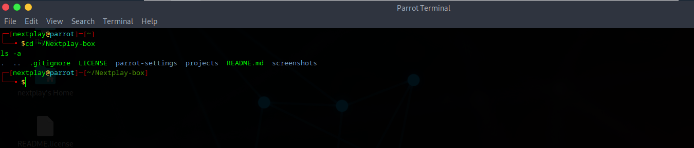

# Nextplay-Box by Augustine

Welcome to **Nextplay-Box** – a personal lab environment built with Parrot OS for learning, practicing, and experimenting with:

- 🐧 Linux commands & bash scripting  
- 🔐 Cybersecurity tools and ethical hacking  
- 📂 Git and GitHub basics  
- 🧰 System configuration and automation  

---

## 💻 About This Project

This is where I document my learning journey in Linux and cybersecurity using Parrot OS. I aim to make this public to:

- Track my progress  
- Share useful scripts and settings  
- Encourage others who are also learning  

---

## 📁 Folders & What They Contain

- `parrot-settings/` → Custom `.bashrc`, aliases, and a list of installed tools  
- `projects/` → Scripts, notes, or challenges I’m working on  
- `screenshots/` → Screenshots for documentation or walkthroughs  
- `README.md` → This intro  
- `.gitignore` → Prevents unnecessary files from being tracked  

---

## 🖼️ Screenshot

---

## ✨ Credits

🛠️ Built with ❤️ by **Augustine Oputa (Nextplay-Box)**  
📄 Licensed under the [MIT License](./LICENSE)  
🔁 Feel free to fork, use, and improve — but please credit the original author!  
🔗 [GitHub – nextplay-box](https://github.com/nextplay-box)

